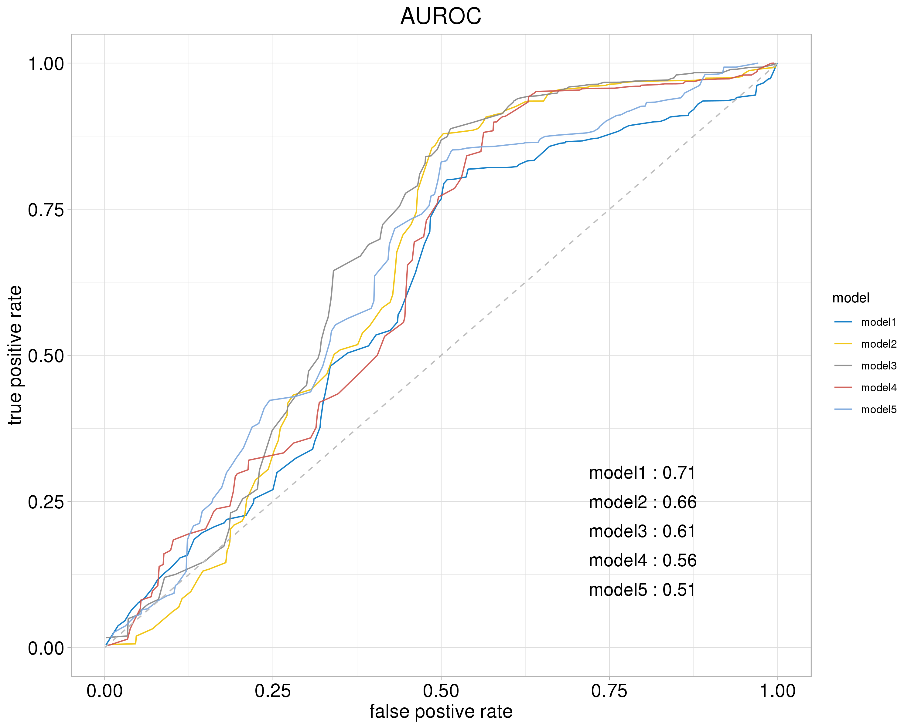
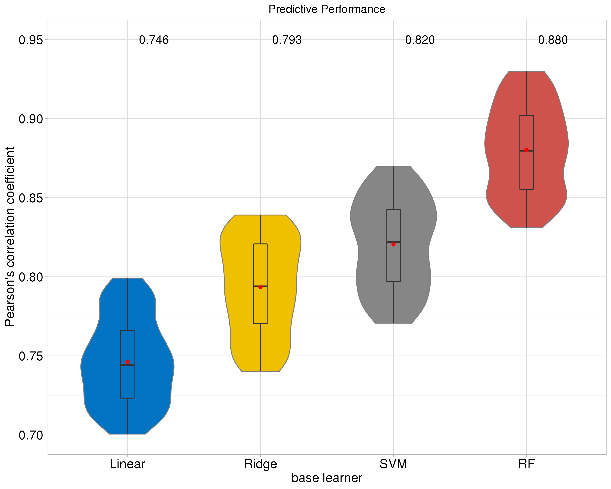

## Example code to generate colorful figures

Please contact (hyangl@umich.edu) if you have any questions or suggestions.

---

## Required dependencies
* [ggplot2](https://www.rdocumentation.org/packages/ggplot2/versions/3.0.0):
```
install.packages('ggplot2')
```
---
## Examples

### 0. signal gif

**output**

<p align="left">

</p>

**input data** (3500*4; 250 length * 14 channels = 3400)

|      | x    | variable   | value     | channel |
| ---- | ---- | ---------- | --------- | ------- | 
| 1    | 0.2  | channel_01 | 0         | 1       |
| 2    | 0.4  | channel_01 | 0         | 1       |
| ...  | ...  | ...        | ...       | ...     | 
| 250  | 50.0 | channel_01 | 0.0000000 | 1       |
| 251  | 0.2  | channel_02 | 0.9239719 | 51      |
| 252  | 0.4  | channel_02 | 1.0000000 | 51      |
| ...  | ...  | ...        | ...       | ...     | 
| 3499 | 49.8 | channel_14 | 0.9167349 | 651     | 
| 3500 | 50.0 | channel_14 | 1.0000000 | 651     | 

**code**

[signal_gif.r](https://github.com/Hongyang449/color_your_figure/blob/master/signal_gif.r)

---

### 1. scatter plot

**output**

<p align="left">

</p>

**input data**

|    |         x |          y |      name |
| -- | --------- | ---------- | --------- | 
| 1  | 0.3076133 | 0.68012495 | object 02 |
| 2  | 0.4414949 | 0.67035409 | object 02 |
| 3  | 0.5517576 | 0.64554303 | object 03 |
| .. |    ...    |     ...    |    ...
| 29 | 0.4855843 | 0.68349135 | object 12 |
| 30 | 0.2726435 | 0.34297157 | object 12 |

**code**

[scatter_plot.r](https://github.com/Hongyang449/color_your_figure/blob/master/scatter_plot.r)

---

### 2. heatmap block

**output**

<p align="left">

</p>

**input data**

|     |  gene |  id |     value |
| --- | ----- | --- | --------- | 
| 1   | gene0 | id0 | 0.3663519 |
| 2   | gene0 | id1 | 0.8200528 |
| 3   | gene0 | id2 | 0.2844916 |
| ... | ...   |     |    ...
| 99  | gene9 | id8 | 1.0256540 |
| 100 | gene9 | id9 | 0.4010756 |

**code**

[heatmap_block.r](https://github.com/Hongyang449/color_your_figure/blob/master/heatmap_block.r)

---

### 3. roc curve

**output**

<p align="left">

</p>

**input data**

|     |      y |     x |  model |
| --- | ------ | ----- | ------ | 
| 1   | 0.0046 | 0.002 | model1 |
| 2   | 0.0375 | 0.020 | model1 |
| 3   | 0.0458 | 0.030 | model1 |
| ... | ...    | ...   | ...    |
| 99  | 0.9862 | 0.994 | model1 |
| 100 | 1.0000 | 0.999 | model1 |
| 101 | 0.0054 | 0.009 | model2 |
| 102 | 0.0064 | 0.046 | model2 |
| 103 | 0.0197 | 0.047 | model2 |
| ... | ...    | ...   | ...    |


**code**

[roc_curve.r](roc_curve.r)
[prototype python code to calculate curves](calculate_roc_prc.py)

---

### 4. violin plot

**output**

<p align="left">

</p>

**input data**

|     | value |  model |
| --- | ----- | ------ | 
| 1   | 0.73  | Linear |
| 2   | 0.76  | Linear |
| 3   | 0.79  | Linear |
| ... | ...   | ...    |
| 99  | 0.74  | Linear |
| 100 | 0.79  | Linear |
| 101 | 0.81  | Ridge  |
| 102 | 0.82  | Ridge  |
| 103 | 0.75  | Ridge  |
| ... | ...   | ...    |


**code**

[violin_plot.r](violin_plot.r)

---

## Reference
* [scientific journal color palettes](https://github.com/road2stat/ggsci)
* [ggplot cheatsheets](https://github.com/rstudio/cheatsheets/blob/master/data-visualization-2.1.pdf)


